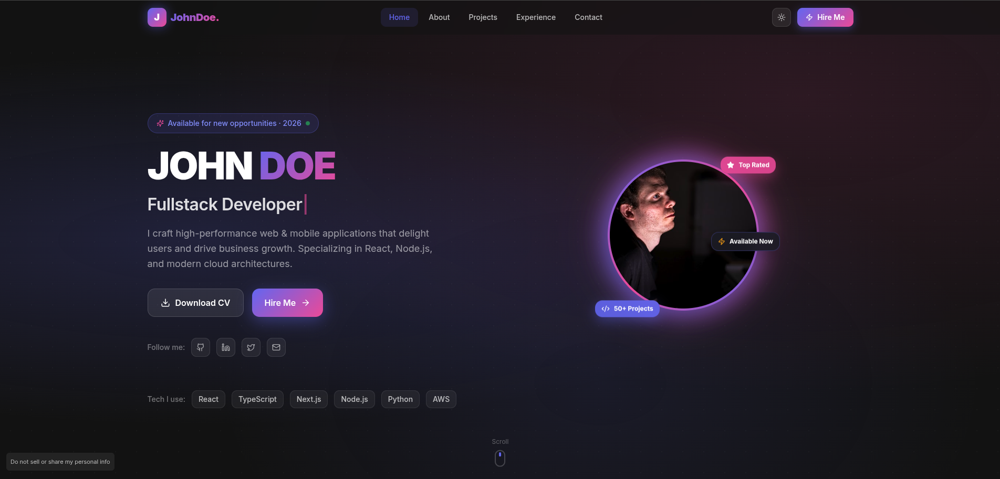
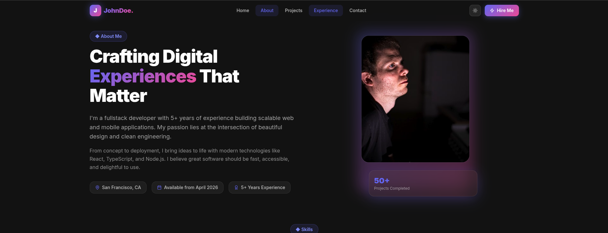
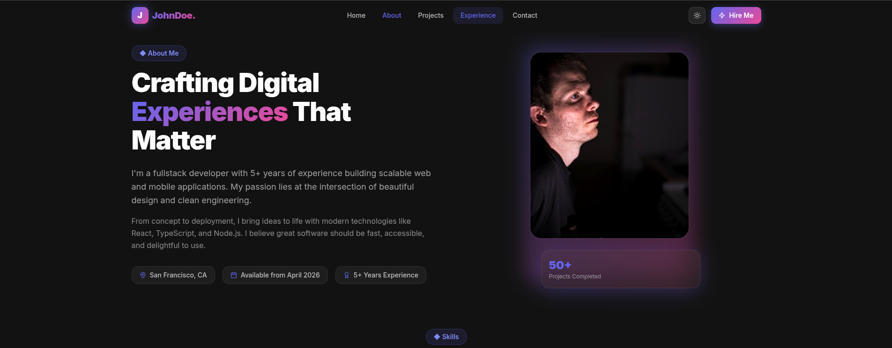
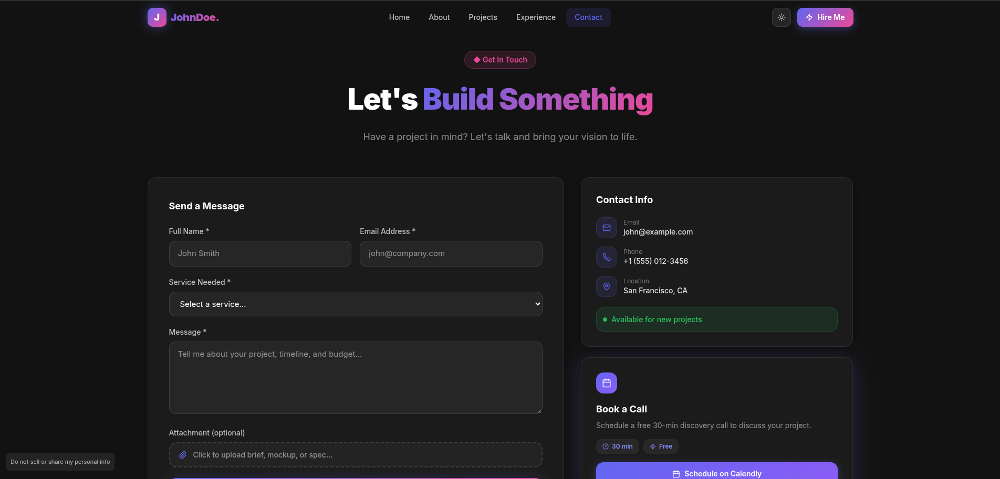

# Developer Portfolio Template

A modern, sleek, and highly interactive personal portfolio template designed for Fullstack Developers, Software Engineers, and UI/UX Designers. Crafted with a dark theme and vibrant neon accents, this template is perfect for showcasing your skills, projects, and professional experience.

## 📸 Screenshots

Here is a preview of the different sections of the portfolio:

### 1. Hero Section
The landing area featuring a bold introduction, key links, and a professional photo with status badges.

### 2. About Me
A detailed look into your professional background, core skills, and experience metrics.

### 3. Projects Showcase
An interactive gallery to display your work, complete with filters, search, and detailed project cards.

### 4. Experience & Skills
A visual representation of your career journey and technical expertise.

### 5. Contact & Booking
A comprehensive section for getting in touch, featuring a contact form and a direct call booking widget.

## 🚀 Features

*   **Modern UI/UX:** Clean, dark-themed design with engaging purple and pink gradient accents.
*   **Hero Section:** Striking introduction with a professional headshot, animated status badges, and quick links to your resume and social profiles.
*   **About Me:** Detailed section to highlight your professional journey, core philosophy, and key stats (e.g., years of experience, projects completed).
*   **Project Showcase:** Interactive portfolio gallery with category filtering (Web, Mobile, Design), search functionality, and detailed project cards featuring tech stacks and external links (Live Demo, GitHub, Case Study).
*   **Contact & Booking:** Comprehensive contact form with file attachment support, alongside direct contact information and a dedicated "Book a Call" widget (e.g., Calendly integration).
*   **Responsive Design:** Fully adaptable layout ensuring a seamless experience across desktop, tablet, and mobile devices.
*   **Tech Stack Display:** Visually appealing pill-shaped badges to instantly communicate your core competencies.

## 🛠️ Built With (Suggested Technologies)

Based on the design, this template is ideal to be built with:

*   **Framework:** [Next.js](https://nextjs.org/) or [React](https://reactjs.org/)
*   **Styling:** [Tailwind CSS](https://tailwindcss.com/) for rapid UI development and custom gradients.
*   **Animations:** [Framer Motion](https://www.framer.com/motion/) for smooth scrolling and element reveals.
*   **Icons:** [Lucide React](https://lucide.dev/) or similar minimal icon libraries.
*   **Typography:** Modern sans-serif fonts like Inter or Roboto.

## 📁 Sections Overview

1.  **Home:** Your digital handshake. Displays your name, title, availability status, and primary call-to-action buttons.
2.  **About:** Dive deeper into your background, location, and overall experience level.
3.  **Projects:** The core of your portfolio. Categorize and display your best work with visual thumbnails and technology tags.
4.  **Experience/Skills:** Highlight your career timeline and technical proficiency.
5.  **Contact:** Make it easy for clients or recruiters to reach out directly or schedule a meeting.

## 🎨 Design Inspiration

This design was originally created in Figma, focusing on a futuristic yet professional aesthetic suitable for modern tech professionals who want to stand out.

---
*Note: This is a README for a design template. You will need to implement the actual code to bring this to life.*
